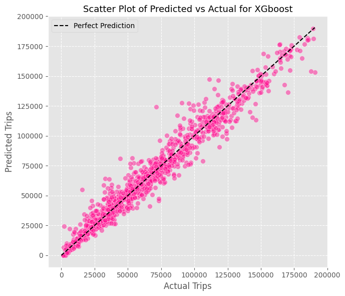

# Citi Bike Demand Forecasting

Forecast citywide daily Citi Bike demand in New York City using weather data and machine learning (Lasso & XGBoost).

## 📖 Overview

This project combines nine years of Citi Bike trip data (2014–2025) with daily weather and calendar features to build and evaluate two models:

- **Lasso regression** – baseline with simple regularization  
- **XGBoost** – gradient-boosted trees with engineered lag/rolling features  

The XGBoost model achieves an MAE of ~13.6%, enabling operators and planners to anticipate ridership patterns and optimize bike redistribution.

## 📑 Paper

The full research paper explaining data sources, methodology, and results is included as a PDF in the repository:

[full research paper](docs/FinalPaper.pdf)

---

## 🗃 Data Sources

* **Citi Bike trip data** (2014–2025): downloaded from [https://citibikenyc.com/system-data][Citi Bike System Data].
* **Weather data**: retrieved via [https://open-meteo.com/en/docs/historical-weather-api][Open-Meteo API] for daily aggregates.

##⚙️ Model Use

The trained XGBoost model is available at outputs/models/xgb_model.pkl and can be loaded and used as follows:

```python
import xgboost as xgb
import pandas as pd

# Load the pretrained XGBoost model from JSON
model = xgb.Booster()
model.load_model('outputs/models/xgb_model.json')

# Load new feature data (ensure columns match training features)
df = pd.read_csv('data/processed/today_features.csv')
dtest = xgb.DMatrix(df)

# Predict daily Citi Bike trips
predictions = model.predict(dtest)
print(predictions)
```




## 📄 License

This project is licensed under the MIT License.
